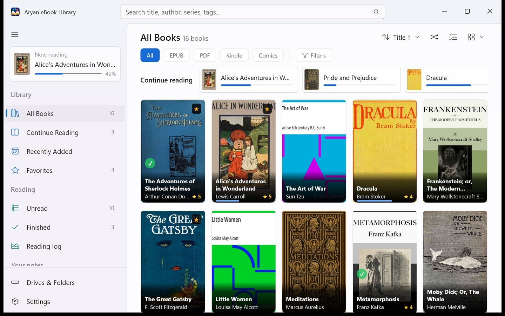
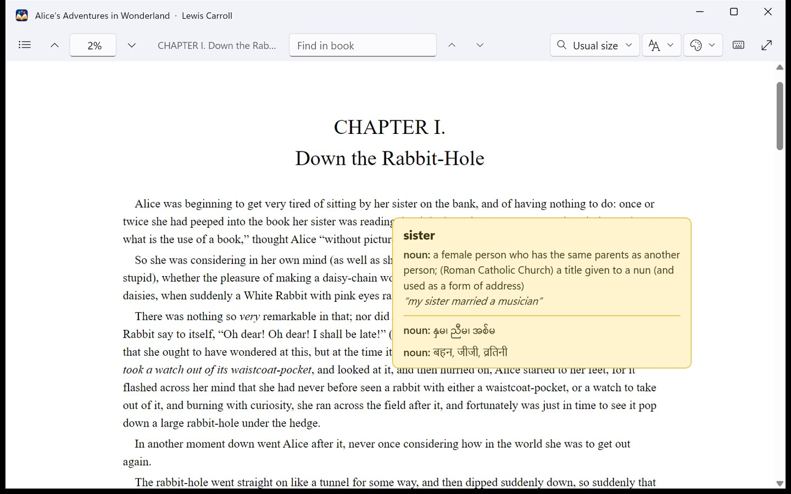
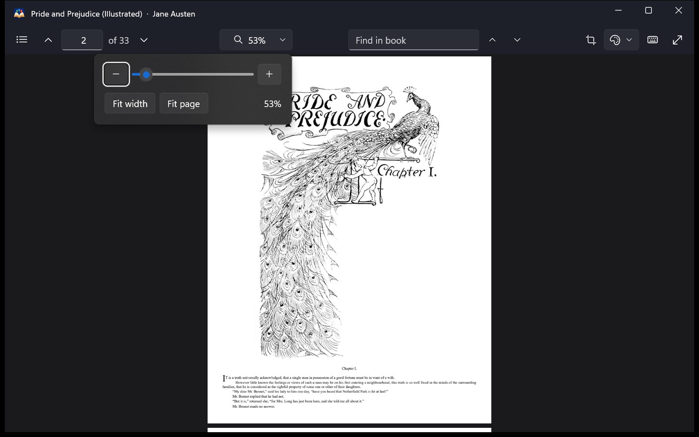
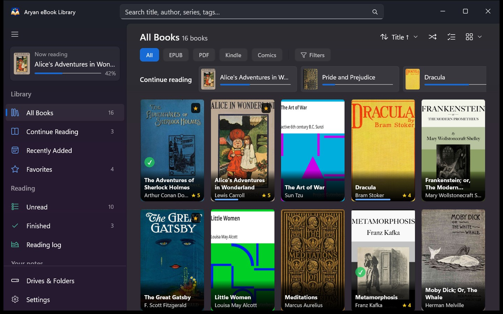

<p align="center">
  
</p>

<h1 align="center">Aryan eBook Library</h1>

<p align="center">
  <b>Every book on every drive, in one library that reads them all.</b><br>
  A fast, good-looking eBook library and reader for Windows. Free, open source, and it works offline.
</p>

<p align="center">
  <a href="../../releases/latest"><b>Download for Windows</b></a>
  &nbsp;·&nbsp;
  <a href="https://aungkokomm.github.io/aryan/guide/">User guide</a>
  &nbsp;·&nbsp;
  <a href="#screenshots">Screenshots</a>
  &nbsp;·&nbsp;
  <a href="#what-it-can-do">What it can do</a>
  &nbsp;·&nbsp;
  <a href="#build-it-yourself">Build it yourself</a>
</p>

<p align="center">
  <a href="LICENSE"></a>
  
  
  
  <a href="../../releases"></a>
</p>

---
>## [About the App name]

>Aryan (आर्यन) is my son's name; he is one year old. In India and across South Asia it is a common given name, meaning "noble" in Sanskrit and Hindi. The app has nothing to do with the racist misuse of the word in 20th-century Europe, which I reject completely.

Your books are everywhere: a folder on this drive, a USB disk in a drawer, a downloads folder you keep meaning to sort. Most eBook managers deal with that by copying everything into a library of their own, renaming your files on the way.

**Aryan leaves every file exactly where it is.** Point it at your folders and it builds one library from all of them, with covers, authors and series, and it reads every book in its own reader. Unplug a drive and its books stay in the library, marked offline. Tidy your folders in File Explorer and Aryan finds the moved books at the next scan, with your notes and highlights still on them.

It is quick, too: a library of 2,800 books is on screen in under three seconds.

## Screenshots

<p align="center">
  
  <br><i>Your whole collection, with what you are reading right at the top.</i>
</p>

<p align="center">
  
  <br><i>Right-click any word for its meaning in English, Myanmar and Hindi. No internet needed.</i>
</p>

<p align="center">
  
  <br><i>PDFs stay sharp at any zoom, with one zoom button in every reader.</i>
</p>

<p align="center">
  
  <br><i>Light or dark, as you like it.</i>
</p>

<p align="center"><sub>The books in these pictures are public-domain classics from Project Gutenberg.</sub></p>

## What it can do

<table>
<tr>
<td width="50%" valign="top">

### 📚 Every drive, one library
Add the folders you keep books in, on any drive. Each drive is known by its hardware ID, so a new drive letter changes nothing, and an unplugged drive's books stay in the library, marked offline. Moved or renamed a file in File Explorer? Aryan finds it again at the next scan.

</td>
<td width="50%" valign="top">

### 📖 A reader for every book
PDFs are drawn by PDFium and stay sharp at any zoom. EPUB, MOBI, AZW3 and KFX books scroll straight through from chapter to chapter, or turn like pages. Comics, whether CBZ, CBR or picture EPUBs, run in one continuous column as wide as the window.

</td>
</tr>
<tr>
<td valign="top">

### 🌏 Exclusive Support for Myanmar and Hindi readers
Right-click an English word for its meaning, with the Myanmar and Hindi translations right underneath. Burmese titles stored in Zawgyi or typed in visual order are shown as proper Unicode, and Myanmar and Hindi file names are read as titles and authors.

</td>
<td valign="top">

### 🖍️ Highlights, clips and notes
Highlight in five colours, clip any part of a page as a picture, and write notes. The Highlights and My Notes pages gather them from every book you own, and one click takes you straight back to the page.

</td>
</tr>
<tr>
<td valign="top">

### 🧭 Pick up where you left off
A Now reading card and a Continue reading row keep your current books first, and every book reopens at your page. The reading log keeps your time and pages, and tells you roughly how long a book has left at your own pace.

</td>
<td valign="top">

### ✨ Details that fill themselves
Titles, authors, series, covers and descriptions come from the book itself, Calibre's `metadata.opf`, the copyright page and even the file name. Online lookups only fill the gaps, and they are off until you turn them on.

</td>
</tr>
<tr>
<td valign="top">

### 🧹 A library that stays tidy
Find duplicate copies, books whose files have gone missing, and books that still need details. Edit many books at once, and sort them into lists, shelves, series and tags.

</td>
<td valign="top">

### 🔒 Yours, and only yours
No account and no tracking, and Aryan never changes, renames or moves a book file. The library lives in one folder beside the app, so it can run from a USB drive, and your favourites, ratings, lists and highlights travel with each drive.

</td>
</tr>
</table>

**Also in the box:** grid and list views, search, filters by format, language, decade, publisher, rating and tags, favourites and ratings, Surprise me, light and dark themes, paper, sepia and night pages, full screen with a toolbar that hides itself, a reader you can drive entirely from the keyboard, backup and restore in one file, catalogue export to CSV, and a copy of your database kept before every upgrade.

<details>
<summary><b>See the full feature list</b></summary>

### Library
- One library from folders on any number of drives, internal or removable
- Drives are known by their hardware ID, so changing drive letters breaks nothing
- Books on an unplugged drive stay in the library, marked offline, and come back when it is plugged in
- Files moved or renamed in File Explorer are found again at the next scan, with everything you gave them. Nothing watches your folders in the background.
- Grid and list views, sorted by title, author, date added and more
- Search across titles, authors, series and tags (Ctrl+F)
- Filters for format, language, decade, publisher, rating and tags, and shelves that save a filter for later
- A sidebar in sections (Library, Reading, Your notes, Browse and Tidy up), with a count on every shelf
- Authors, Series and Tags pages, and lists of your own
- Favourites, ratings, reading status, notes and tags for every book
- Duplicates, Missing and Needs details pages, and editing many books at once
- Surprise me, for when you cannot choose

### Reading
- PDF: drawn by PDFium, sharp at every zoom up to 800%, continuous pages, fit width or fit page, text selection, find, the book's own outline, and links with Back and Forward
- EPUB, MOBI and AZW3: scroll through the whole book or turn pages, text size, find, and the contents
- KFX, Amazon's newest Kindle format: read the same way, through an EPUB copy made once and kept in the data folder (books locked with DRM cannot be read)
- Comics: CBZ, CBR and EPUBs made only of pictures, as one continuous column or a page at a time
- One zoom button in every reader: minus, a slider, plus, and Fit width or Fit page (in books, the text size)
- Paper, sepia and night pages, full screen, and a toolbar that hides until you point at it
- One maximized window per book, and every key listed with F1
- Every book reopens where you left it

### Notes
- Highlights in five colours, clipped pictures of any area, and page notes
- Highlights and My Notes pages across all your books: search them, sort them, and jump back to the page
- A reading log with your time, your pages, and the time a book has left at your pace

### Words
- Define: English meanings from WordNet, with Myanmar and Hindi translations, all offline
- Burmese in Zawgyi or visual order is shown as proper Unicode (the files themselves are never touched)

### Details
- Read from the book itself, Calibre's `metadata.opf`, copyright pages and file names
- Online lookups, if you turn them on: Open Library, Wikidata, Wikipedia, and Google Books with your own free key. They only fill what is missing, and send only a title, author or ISBN.
- Edit a title, author or series yourself at any time

### Your data
- One portable folder, `AryanLibrary-Data`, beside the app
- Your favourites, ratings, lists, notes and highlights are also kept in small files beside the books on each drive, so they travel with the drive to another PC
- Backup and restore in one file, and catalogue export to CSV
- Before a new version upgrades the database, the old one is copied to `AryanLibrary-Data\Backups`
- One copy of the app per library, so two windows never fight over it

</details>

## Get it

1. Download `AryanEbookLibrary-Setup-<version>.exe` from the [latest release](../../releases/latest).
2. Run it and choose how you want Aryan:
   - **Install for me:** for your user only, with no administrator rights needed, a Start menu entry, and an uninstaller in Settings > Apps.
   - **Portable:** into any folder you like, a USB drive included. Nothing is written to Windows, and the whole folder, library and all, can move to another drive or PC.
3. Add the folders where your books are, and let it scan.

New to Aryan? The [getting-started guide](https://aungkokomm.github.io/aryan/guide/) walks you through your first hour, from adding your books to highlights and backups.

To update, run the newer Setup on the same folder: your library is kept. A portable copy can also be made silently, with `AryanEbookLibrary-Setup-<version>.exe /VERYSILENT /PORTABLE /DIR="E:\Aryan"`.

> [!NOTE]
> This free project isn't code-signed, so Windows SmartScreen may say it doesn't recognise the app. Click **More info**, then **Run anyway**.

Aryan runs on **Windows 10 (version 1809 or later) and Windows 11**, on 64-bit PCs. It carries its own runtime, so there is nothing else to install. The book reader uses Microsoft Edge WebView2, which Windows 11 and current Windows 10 already have.

## Your books stay yours

No account, no telemetry, and nothing about you or your books ever leaves your PC. Aryan only ever reads your book files: nothing in them is changed, renamed or moved. When it starts, it asks GitHub whether a newer version is out and, if one is, offers it in a small bubble you can dismiss; it never downloads or installs anything by itself. Otherwise it goes online only if you turn on online details, and then sends nothing but a title, author or ISBN. Its log, `aryan.log`, stays on your computer.

## Handy keys

Press **F1** in any reader to see them all. A few favourites:

| | |
|---|---|
| **Ctrl+F** | Search the library, or find in the book you are reading |
| **Space**, **Page Down** | Down one screen |
| **Right**, **Left** | Next or previous page |
| **Ctrl+G** | Go to a page |
| **Ctrl+plus / minus / 0** | Zoom in, out, or back to the fit (in books, the text size) |
| **Alt+Left**, **Alt+Right** | Back and forward after a link or a jump |
| **F11** | Full screen |
| **Alt** | Move to the reader's toolbar |
| **Ctrl+W** | Close the book |

## Build it yourself

<details>
<summary><b>What you need, and the steps</b></summary>

### What you need
- Windows 10 or 11, x64
- [Visual Studio 2026](https://visualstudio.microsoft.com/) with the **.NET desktop development** workload. Build with Visual Studio's MSBuild.
- The [.NET 10 SDK](https://dotnet.microsoft.com/)
- [Rust](https://rustup.rs/), stable, for `x86_64-pc-windows-msvc`
- [Inno Setup 6](https://jrsoftware.org/isinfo.php), only to build the installer

PDFium comes with the repository, in `native/reader_core/vendor/pdfium`, from [pdfium-binaries](https://github.com/bblanchon/pdfium-binaries).

### Steps

1. **Fetch the reading core's crates, once.** The app build runs `cargo` offline, so the crates need to be on your PC first:

   ```
   cd native\reader_core
   cargo fetch
   ```

2. **Build and run.** Open `AryanEbookLibrary.sln` in Visual Studio, pick x64 and press F5. The Rust core, `reader_core.dll`, is built by `cargo` as part of the build.

   Or build from a Developer PowerShell for Visual Studio:

   ```
   MSBuild AryanEbookLibrary.csproj -t:Build -restore -p:Configuration=Release -p:Platform=x64
   ```

3. **Run the tests:**

   ```
   dotnet test tests\AryanEbookLibrary.Tests -p:Platform=x64
   cd native\reader_core
   cargo test --release
   ```

   [tests/README.md](tests/README.md) describes the checks that run against a real library, and the off-screen checks of the running app.

4. **Build the installer** into `dist\`:

   ```
   pwsh -File tools\build_installer.ps1
   ```

   It never overwrites an existing installer, so raise `<Version>` in the project first.

</details>

## Under the hood

The window is **WinUI 3** in C# on .NET 10 with the Windows App SDK, and it carries its own runtime. PDFs are drawn by a small **Rust** core on **PDFium**, through pdfium-render. EPUB, MOBI and AZW3 books are read by **foliate-js** in WebView2 (KFX books too, once **boko** has made an EPUB copy), comics come out of their archives through **SharpCompress**, and the catalogue lives in **SQLite**.

<details>
<summary><b>Where things are</b></summary>

| Folder | What is in it |
|---|---|
| `Views/`, `MainWindow.xaml` | The library's pages and windows |
| `ViewModels/` | The library: scanning, filters, shelves and counts |
| `Services/` | The database, drives, sidecar files, backups and the reading log |
| `Services/Metadata/` | Reading details from books, `metadata.opf`, copyright pages and file names |
| `Services/Online/` | Open Library, Wikidata, Wikipedia and Google Books |
| `Reader/` | The PDF, book and comic readers, highlights and Define |
| `Assets/Epub/` | foliate-js and the page script that drives it |
| `native/reader_core/` | The Rust core on PDFium, and its tests |
| `vendor/boko/` | boko, the separate program that turns KFX books into EPUB, with its licence and source details |
| `installer/` | The Inno Setup script |
| `tools/` | The installer and deploy scripts |
| `tests/` | The C# tests, real-library checks and off-screen UI checks |

</details>


## Licence

Aryan eBook Library is free and open source under the [MIT License](LICENSE), and so are its Myanmar and Hindi dictionaries.

It stands on the work of many others, each under its own licence. See [THIRD-PARTY-NOTICES.txt](THIRD-PARTY-NOTICES.txt) and the [licenses](licenses/) folder; the app shows them in Settings > About too.

KFX books are turned into EPUB by [boko](https://github.com/zacharydenton/boko), a separate program that comes with Aryan and keeps its own licence, the GNU GPL v3 or later. It is not part of Aryan's MIT-licensed code; [vendor/boko](vendor/boko/README.txt) says where its source is and how it was built.

## Thanks

To John Factotum for foliate-js; to Zach Denton for boko; to the people behind PDFium, pdfium-binaries, pdfium-render, SharpCompress, PdfPig and SQLite; to Princeton University for WordNet; to Open Library, Wikidata and Wikipedia for the details they share with everyone; and to Project Gutenberg for the books in the screenshots.

---

<p align="center"><sub>© 2026 Aung Ko Ko · <a href="https://aungkokomm.github.io/">more of my apps</a></sub></p>
